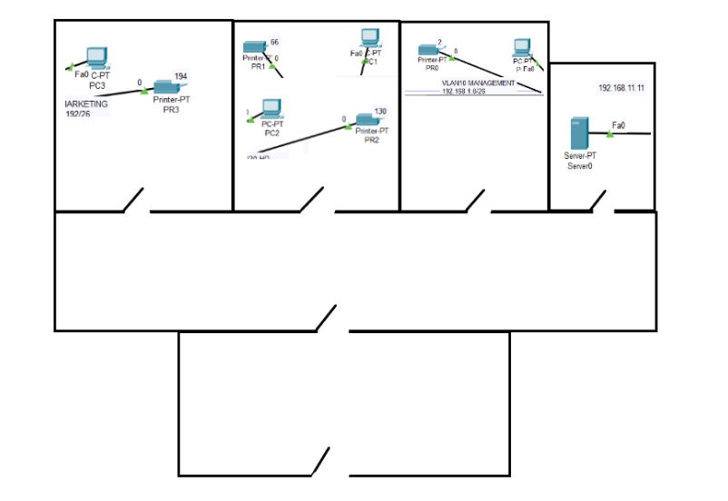

# Saját cég bemutatása
Az ITWorks informatikai szolgáltatásokat nyújt széles körben, főleg hálózatok kiépítését, de más szolgáltatásokat is.
# Az ügyfél
A Cacti.hu egy növények értékesítésével foglalkozó kisvállalkozás, és arra kért fel bennünket, építsünk ki nekik egy biztonságos, és hatékony hálózatot új irodájukba.
# A helyszín
Az épületben található egy váró és lobby is, valamint 3 külön iroda és 1 szerverszoba is.

# Igényfelmérés
Az alábbi táblázat tartalmazza a részletes Címzési tervet.  
Hálózat|VLAN|Portok
-|-|-

# VLANOK
A cég összes részlege külön VLAN-ba került, így könnyen elkülöníthetőek.
NUMBER|NAME|
-|-|
10|MANAGEMENT
20|VEZETOSEG
30|HR
40|MARKETING

Az alábbihoz hasonlóan jártunk el a többi VLAN esetében is.
```
SW1(config)#vlan 10
SW1(config-vlan)#name MANAGEMENT
```
---
A VLAN-ok létrehozását **SW1,SW2 és SW3** kapcsolókon automatizáltuk VTP protokoll használatával, ami létrehozza a szerveren lévő VLAN-okat a klienseken.

VTP|érték
-|-
szerver|SW1
kliens|SW2,SW3
domain|cacti.hu
jelszó|cacti
verzió|2
```
SW1(config)#vtp mode server
SW1(config)#vtp domain cacti.hu
SW1(config)#vtp password cacti
SW1(config)#vtp version 2
```
---
A táblázat alapján hozzárendeltük a portokhoz a megdelelő VLAN-okat és beállításra kerültek a trönk portok is, az alábbihoz hasonló módon.
```
SW1(config-vlan)#interface range FastEthernet 0/1-2
SW1(config-if-range)#switchport mode access
SW1(config-if-range)#switchport access vlan 10
SW1(config-if-range)#interface GigabitEthernet 0/1
SW1(config-if)#switchport mode trunk
```
---
Le is ellenőrizhető az eredmény a ``show vlan brief`` paranccsal.
```
...
10   MANAGEMENT                       active    
20   VEZETOSEG                        active    
30   HR                               active    
40   MARKETING                        active    Fa0/1, Fa0/2
...
```
Ezek után a kapcsolók melletti forgalomirányítót beállítottuk az IEEE 802.1Q szabványnak megfelelően.
# STP
A hurkok elkerülése érdekében feszítőfa protokollt alkalmaztunk az összekötött kapcsolókon.

A gyorsabb alkalmazkodás eléréséhez rapid-pvst+-t alkalmaztunk a 10-es, 20-as, 30-as, és 40-es vlanokon külön és mindegyiknél a legközelebbi kapcsoló a root, valamint PortFastot is beállítottunk, így az interfész egy pillanat alatt elérhetővé válik.
```
SW1(config)#spanning-tree mode rapid-pvst
SW1(config)#spanning-tree vlan 10,20,30,40
SW1(config)#spanning-tree portfast default
SW1(config)#spanning-tree vlan 10 root primary
```
---
A ``show spanning-tree summary`` paranccsal látható ahogy az STP működik.
```
Switch is in rapid-pvst mode
Root bridge for: MANAGEMENT
Extended system ID           is enabled
Portfast Default             is enabled
PortFast BPDU Guard Default  is enabled
Portfast BPDU Filter Default is disabled
Loopguard Default            is disabled
EtherChannel misconfig guard is disabled
UplinkFast                   is disabled
BackboneFast                 is disabled
Configured Pathcost method used is short

Name                   Blocking Listening Learning Forwarding STP Active
---------------------- -------- --------- -------- ---------- ----------
VLAN0010                     4         0        0          5          9
VLAN0020                     6         0        0          3          9
VLAN0030                     6         0        0          3          9
VLAN0040                     6         0        0          3          9

---------------------- -------- --------- -------- ---------- ----------
6 vlans                     22         0        0         14         36

```
# Etherchannel

Redundancia és terheléselosztás céljából etherchannelt is implementáltunk az összes kapcsoló között.
# DHCP

# Telnet/SSH

# HSRP

# Biztonság
## VLAN biztonság
```
SW1(config-if)#switchport nonegotiate
SW1(config-if)#switchport trunk allowed vlan 10,20,30,40
SW1(config-if)#switchport trunk native vlan 99
```
## Portbiztonság

## Jelszavak titkosítása

## DHCP Snooping

## DAI

## BPDU Guard

# Forgalomirányítás

# NAT, Portátirányítás

# WiFi

# Server

# GRE
