# Etherchannel
A port-channel aktív és minden portja működik
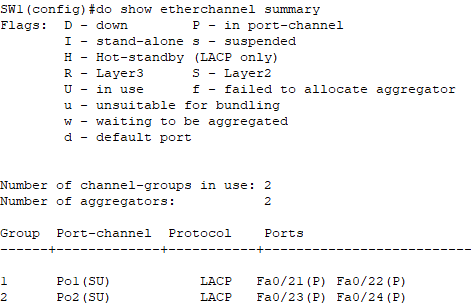  
A keret az Fa0/22,24-es portokon át megy
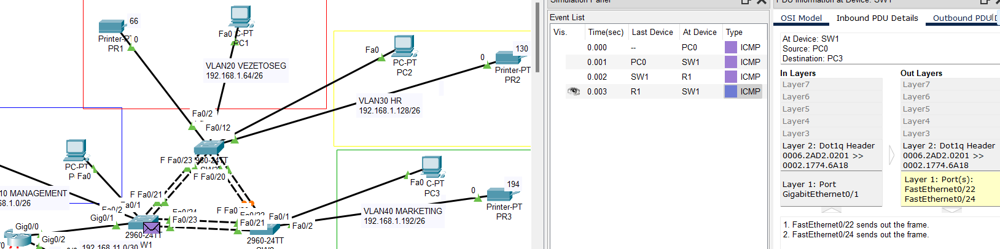  
Miután ezt a két portot lekapcsoljuk (ezzel szimulálva azok kiesését)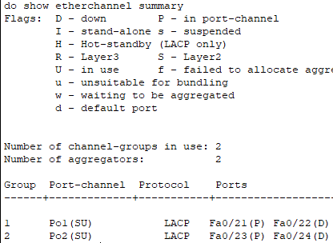  
A keret az Fa0/21,23-as portokon át fog menni
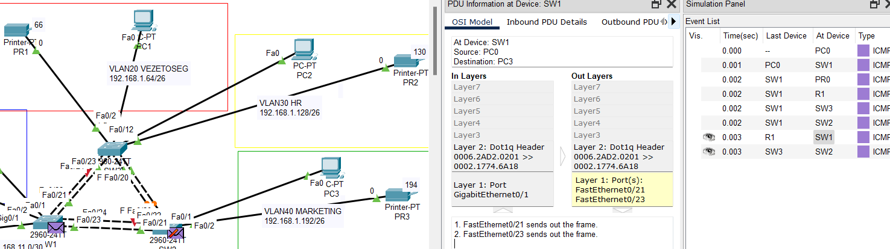
Valamint az is látszik, hogy az STP nem külön tiltja le a portokat, hanem az egyik ágon csak
# STP
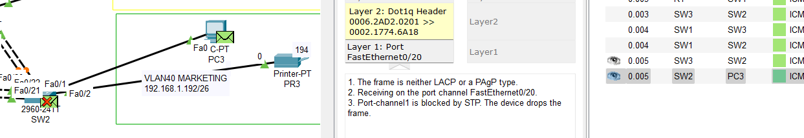
Ha mindkét útvonal elérhető az egyiket az STP letiltja amíg a másik elérhető, ezzel elkerülve a hurkok kialakulását.  
Ha azonban az aktív út megszakad, a hálózat a másik utat választja
SZimuláljuk ezt azzal, hogy a port channel 2 portjait letiltjuk
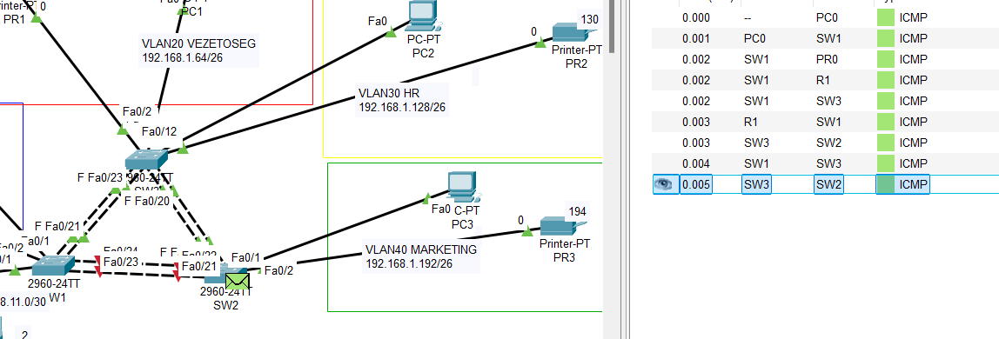  
jól látható hogy ezúttal a fenti úton ment a csomag és mivel nincs is más út, az STP sem tiltotta.
# DHCP
PC0 megkapja a címeket DHCP-n
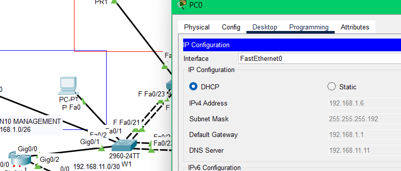
# Telnet/SSH
PC0 connected to SW0 via Telnet
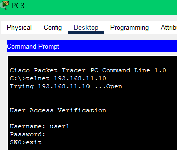  
PC2 connected to SW4 via Telnet
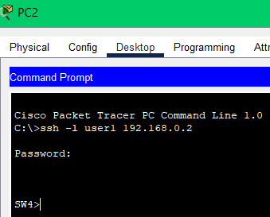
# HSRP
Láthatjuk, hogy R1 az aktív router
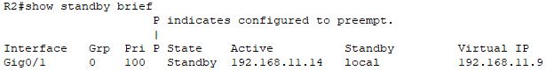
és itt mennek a csomagok
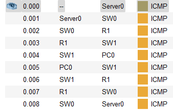
De miután kiesik(Lekapcsoljuk a portot)
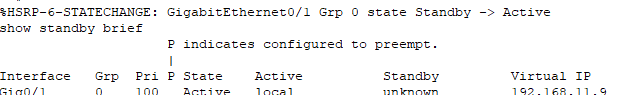
aktívvá válik R2

és a csomagok is itt mennek
R1 visszaveszi az aktív szerepet
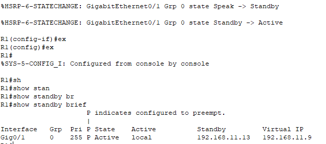
# Biztonság
## Portbiztonság
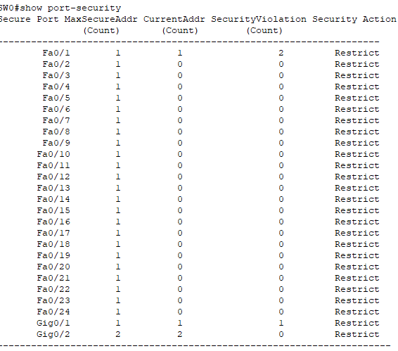
felcsatlakoztatunk egy porta egy nem megbízható eszközt
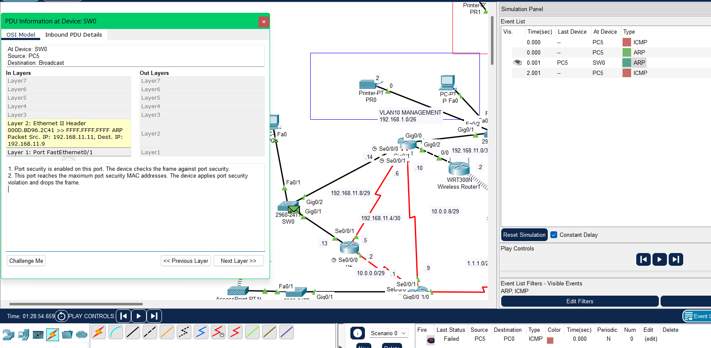
A kapcsoló eldobja a keretet
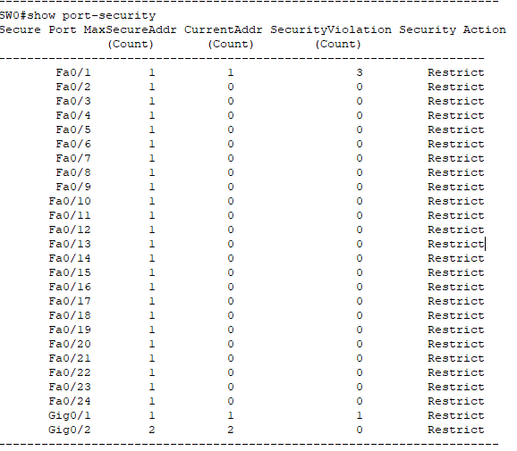
És a port sértés számláló is növekedett
## DHCP snooping
Felcsatlakoztatunk egy nem megbízható DHCP szervert
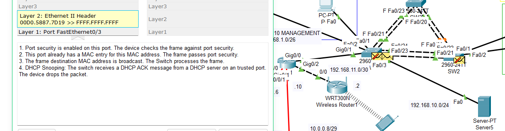
A kapcsoló dobja a keretet
# Dinamikus forgalomirányítás

# NAT, Portátirányítás
Jól látható, hogy a router natolta a csomagot mielőtt, kiengedte volna
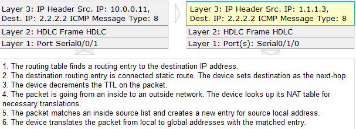
# WiFi
Látható, hogy az eszközök megkapják az összes szükséges információt
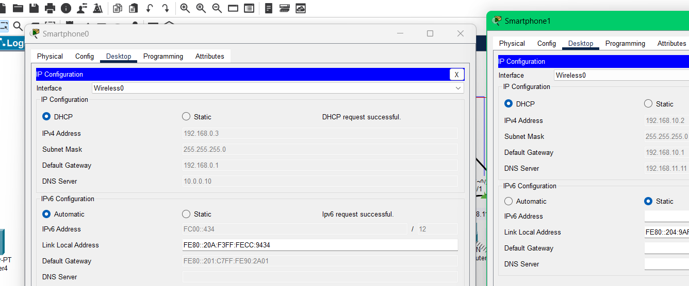
# Szerver szolg.
## WEB
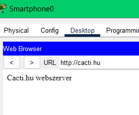
## FTP
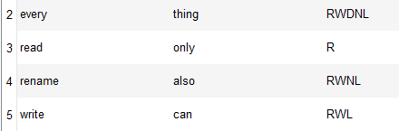
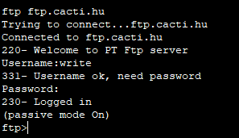
## MAIL
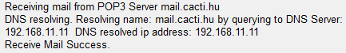
## TFTP

# GRE alagút
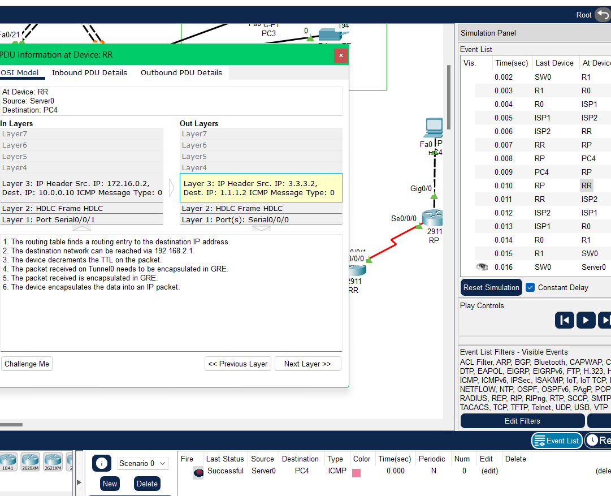